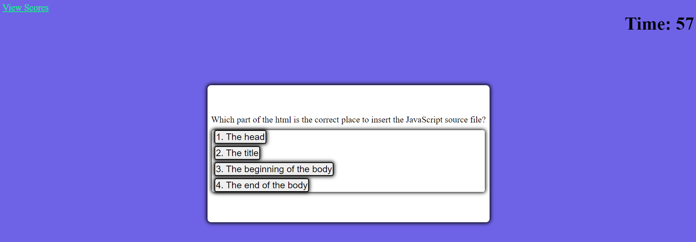

## Purpose
 Create a quiz application that will run in the browser and feature dynamically updated HTML and CSS powered by JavaScript code. This game should feature a countdown clock that subtracts time for an incorrect answer and the ability to save your initials and score using localStorage. 

## Screenshot

## Deployed URL: 
<https://smith-utxo.github.io/Code-Quiz/>

## Legal Notice
 © Adam T. Smith, U of M Coding Boot Camp 

Licensed under the [MIT license](LICENSE)

## Contributors 
- Adam T. Smith <smith.adam937@gmail.com> 